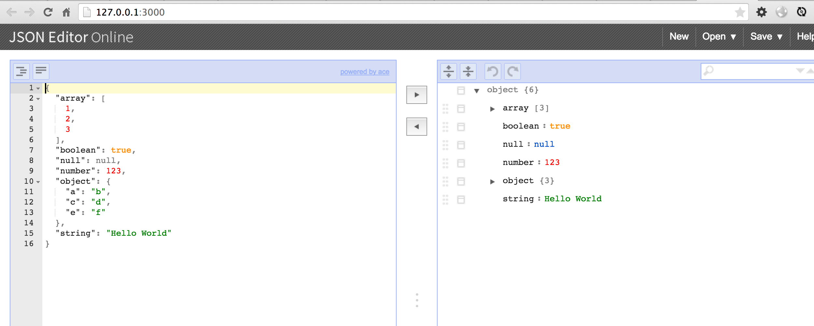

# je = json editor

json editor port to npm

[](http://badge.fury.io/js/je)

## Install 

    [sudo] npm install -g je
  
## Usage

in terminal 

```
  je
```
  
or
 
```
  je -f xxx.json
  je --url http://xxxx
```




## Contributing

1. Fork it
2. Create your feature branch (`git checkout -b my-new-feature`)
3. Commit your changes (`git commit -am 'Add some feature'`)
4. Push to the branch (`git push origin my-new-feature`)
5. Create new Pull Request

## 版本历史

- v1.0.0 初始化版本cli

## 欢迎fork和反馈

- write by `i5ting` i5ting@126.com

如有建议或意见，请在issue提问或邮件

## License

this repo is released under the [MIT
License](http://www.opensource.org/licenses/MIT).
